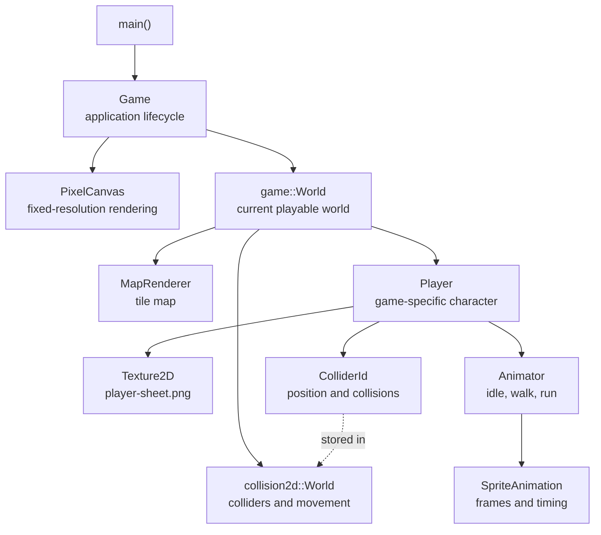
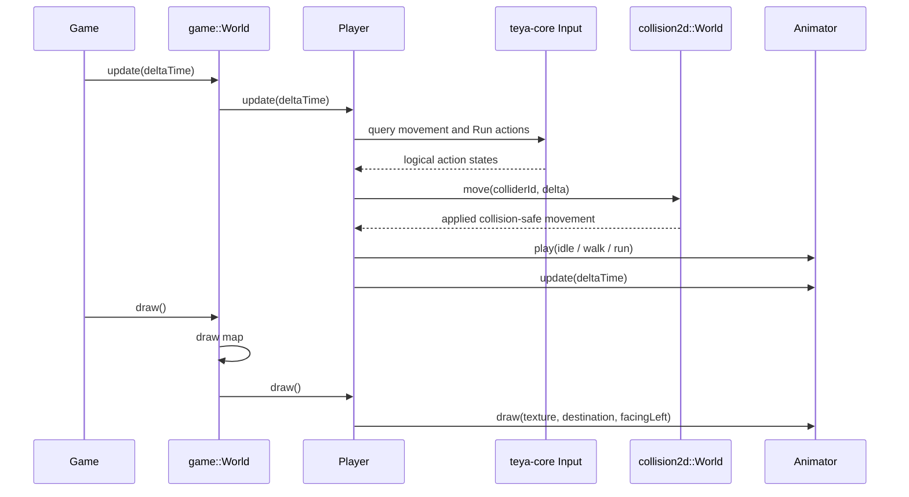
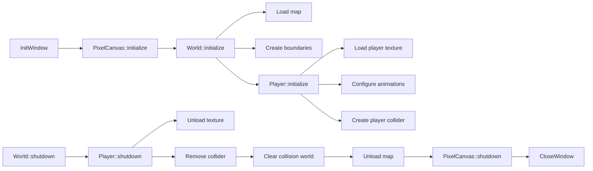

# Game architecture

## Development editor

The optional `external/teya-game-editor` submodule sits between Teya 2D and the
game template and exposes `Teya::GameEditor`. Configure `editor` (or
`windows-editor`) to enable it. Debug, release, and profile explicitly remain
editor-free, so they neither configure nor download Dear ImGui/rlImGui.

The game still owns the raylib window, state machine, world, and `PixelCanvas`.
After those resources initialize it creates the editor. Gameplay is always drawn
at the fixed canvas resolution; editor builds show that render texture, vertically
flipped, centered and integer-scaled in Game View. The host supplies immutable
runtime snapshots with stable IDs. One game-level Boolean gates player input based
on Game View focus/capture, ImGui capture, modal state, and simulation state.

Play updates normally, Pause continues rendering/editor interaction without world
updates, and Step performs exactly one update at `1/60` second before pausing.
Editor shutdown precedes canvas/window destruction through `Game` member ownership.

This document describes the current 2D game-template architecture and where new
code should live. The central rule is that `Game` manages the application,
`game::World` manages world contents, and `Player` manages player behavior.

## Ownership hierarchy



The arrows mean “owns” or “controls.” The player does not own the collision
world. It keeps a pointer to the world and the ID of its own collider.

## Module boundaries

| Location | Responsibility | Examples |
| --- | --- | --- |
| `teya-core` | Generic game-independent foundations | Input actions, logging, asset paths |
| `teya-2d` | Generic reusable 2D systems | Animation, collision, pixel canvas |
| `teya-game-template` | Rules and content for this game | Player, world, map choice, spawn point |

Game-specific classes should stay in the game project. Move code into a shared
module only when it is useful to multiple different games.

## Source layout

```text
src/
├── main.cpp                 Starts the application
├── game/
│   ├── Game.h               Owns PixelCanvas and game::World
│   └── Game.cpp             Window, loop, update and presentation
├── world/
│   ├── World.h              Owns map, collision world and player
│   └── World.cpp            Loads and updates the playable world
└── player/
    ├── Player.h             Player state and public interface
    └── Player.cpp           Input, movement, animation and drawing
```

## Frame lifecycle

Every frame follows this path:



`Game` does not know which keys move the player, how sprite-sheet frames are
calculated, or where the player's collider is stored.

## Initialization and shutdown

Resources that depend on raylib must be created after `InitWindow()` and released
before `CloseWindow()`.



Both `World` and `Player` make `shutdown()` safe to call more than once. `Game`
still calls shutdown explicitly to guarantee GPU resources are released before
the window closes.

## Player responsibilities

`Player` owns everything that is specific to the controllable character:

- Loads and unloads `assets/textures/player-sheet.png`.
- Queries logical actions from `teya-core`.
- Normalizes diagonal input.
- Selects walk or run speed.
- Asks the collision world to move its collider.
- Remembers whether the character faces left.
- Selects and updates idle, walk, and run animations.
- Draws the animated sprite at the collider's feet.

The public interface is intentionally small:

```cpp
bool initialize(teya::collision2d::World &world,
                teya::collision2d::Vector2 position);
void shutdown();
void update(float deltaTime);
void draw() const;
```

## Input actions

The player never queries physical keys directly. It queries these logical
`teya-core` actions:

| Action | Default bindings |
| --- | --- |
| `MoveLeft` | A or Left Arrow |
| `MoveRight` | D or Right Arrow |
| `MoveUp` | W or Up Arrow |
| `MoveDown` | S or Down Arrow |
| `Run` | Left Shift or Right Shift |

This keeps keyboard bindings inside `teya-core` and gameplay behavior inside
`Player`.

## Player sprite sheet

The player expects one transparent PNG at
`assets/textures/player-sheet.png`.

```text
Full sheet: 288 x 144 pixels
Grid:       6 columns x 3 rows
Cell:       48 x 48 pixels

             column 1   2   3   4   5   6
           ┌─────────┬───┬───┬───┬───┬───┐
row 0 idle │ frame 1 │ 2 │ 3 │ 4 │ - │ - │
           ├─────────┼───┼───┼───┼───┼───┤
row 1 walk │ frame 1 │ 2 │ 3 │ 4 │ 5 │ 6 │
           ├─────────┼───┼───┼───┼───┼───┤
row 2 run  │ frame 1 │ 2 │ 3 │ 4 │ 5 │ 6 │
           └─────────┴───┴───┴───┴───┴───┘
```

The final two idle cells must be empty and transparent. Frames must not have
margins, gaps, borders, or spacing between them. Keep the character's feet on
the same baseline in every frame.

Animation timing is currently:

| State | Frames | Seconds per frame |
| --- | ---: | ---: |
| Idle | 4 | 0.18 |
| Walk | 6 | 0.11 |
| Run | 6 | 0.075 |

All frames face right. `Animator::draw()` flips the source rectangle when the
player faces left.

## Where future features belong

| Feature | Recommended location |
| --- | --- |
| Enemies, crops, NPCs, pickups | `teya-game-template/src/` |
| Which map is loaded | `game::World` |
| Map transitions and spawn points | `game::World` or a game-specific world manager |
| Generic camera behavior | `teya-2d` |
| Generic collision shapes and queries | `teya-2d` |
| New physical key bindings | `teya-core` |
| Player stamina or abilities | `Player` or a game-specific player component |

Avoid making `Game` aware of individual entities. As the project grows, it
should continue to coordinate the application and delegate gameplay to the
world.
